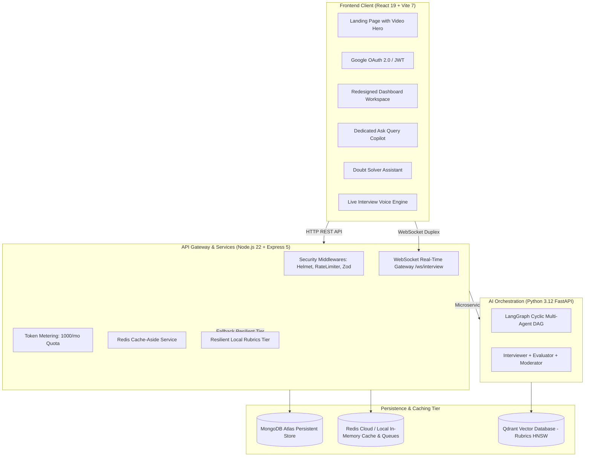

# 🎯 Prep — Enterprise AI Mock Interview & System Design Platform

> **Transforming Technical Interview Preparation into an Ultra-Low-Latency, Distributed Simulation Engine**

[](https://reactjs.org/)
[](https://vitejs.dev/)
[](https://nodejs.org/)
[](https://expressjs.com/)
[](https://python.org/)
[](https://fastapi.tiangolo.com/)
[](https://www.mongodb.com/)
[](https://redis.io/)
[](https://qdrant.tech/)
[](https://docker.com/)

---

## 📖 Table of Contents

- [Overview & Architecture](#-overview--architecture)
- [Key Features](#-key-features)
- [System Architecture Diagram](#-system-architecture-diagram)
- [Tech Stack](#-tech-stack)
- [Folder Structure](#-folder-structure)
- [Environment Setup & Configuration](#-environment-setup--configuration)
- [Local Development Quickstart](#-local-development-quickstart)
- [Docker Deployment Runbook](#-docker-deployment-runbook)
- [Security Architecture & Asset Protection](#-security-architecture--asset-protection)
- [Testing Strategy](#-testing-strategy)
- [Documentation Index](#-documentation-index)

---

## 💡 Overview & Architecture

**Prep** is an enterprise-grade technical interview simulation platform engineered to bridge the gap between candidate preparation and real-world hiring loops at top technology companies.

Traditional interview prep tools are synchronous, text-bound HTTP prototypes. Prep is engineered as a **distributed system**:
- **Low-Latency Audio Pipeline:** Bidirectional WebSockets with Groq LLM streaming and candidate barge-in interruption handling.
- **Resilient Caching Topologies:** In-memory Redis cache-aside architecture shielding MongoDB from repetitive read pressure.
- **Deterministic Multi-Agent State Machine:** LangGraph Python microservice running cyclic Finite State Machines (Interviewer, Evaluator, and Moderator agents) with crash recovery.
- **RAG Scoring Rubrics:** Qdrant vector database with HNSW indexing, supported by a resilient Node.js local fallback tier.
- **FinOps Quota Engine:** User token allocation (1,000 monthly tokens) metered transactionally at the API gateway layer.

---

## 🚀 Key Features

1. **Modern High-Converting Landing Page:**
   - Sleek white/light-gray SaaS hero section embedding high-definition demonstration video (`subject.mp4`).
   - Seamless floating AI evaluation card with dynamic score metrics.
2. **Redesigned Workspace Dashboard (`/dashboard`):**
   - Clean, professional information hierarchy.
   - Dual-domain workspace: **Technical Tracks** (System Design, Backend, Frontend) vs. **HR & Behavioral Rounds** (STAR Mastery, Leadership).
   - Real-time track metrics (Active Tracks, Q&A Bank, Mocks Completed).
3. **Dedicated "Ask Query" Technical Copilot (`/ask-query`):**
   - Integrated into authenticated navbar navigation.
   - Multi-role context calibration (Distributed Systems, React, Algorithms).
   - Code snippet attachment drawer supporting 7 languages.
   - Markdown rendering with Prism syntax highlighting and 1-click Markdown transcript export.
4. **Interactive Doubt Solver (`/doubt-solver`):**
   - 24/7 technical mentor with structured question diagnosis and token-metered query execution.
5. **Live Voice Mock Simulation (`/interview/:id/live`):**
   - Full-duplex speech-to-text (STT) and text-to-speech (TTS) with audio level metering and real-time rubric evaluation.
6. **Authentication & Security:**
   - One-click Google OAuth 2.0 registration on `/signup`.
   - Dual login (Email/Password + Google) on `/login`.
   - Client route protection via session-verified `<ProtectedRoute>`.

---

## 🏛️ System Architecture Diagram



---

## 🏗️ Tech Stack

| Domain | Technologies |
|---|---|
| **Frontend** | React 19.1, Vite 7.0, Tailwind CSS 4.1, Framer Motion 12.38, React Router 7.6, Prism Highlighter |
| **Backend Gateway** | Node.js 22 LTS, Express 5.1, Mongoose 8.16, ioredis 6.0, BullMQ 6.3, Multer 2.0, Zod 4.6, Pino 10.3 |
| **Microservice & AI** | Python 3.12, FastAPI, LangGraph, Qdrant Client, Groq SDK |
| **DevOps & Infra** | Docker Multi-Stage (Alpine), Docker Compose, Nginx 1.27 Alpine, Redis 7, MongoDB 7 |

---

## 📂 Folder Structure

```text
Prep/
├── backend/                  # Node.js Express 5 API Gateway
│   ├── config/               # DB connection & Redis singleton
│   ├── controllers/          # Business logic (Auth, AI, Sessions, Questions)
│   ├── middlewares/          # JWT protect, rate limiting, token deduct, Zod validate
│   ├── models/               # Mongoose schemas (User, Session, Question)
│   ├── routes/               # API route definitions
│   ├── services/             # CacheService, RAGService, StreamingAIService
│   ├── test/                 # 50 Automated unit & integration tests
│   ├── validators/           # Zod validation schemas
│   └── websocket/            # WebSocket connection manager & streaming server
│
├── frontend/                 # React 19 + Vite SPA Client
│   ├── public/               # Static assets & marketing video (subject.mp4)
│   └── src/
│       ├── components/       # Reusable cards, modals, layout bars, ProtectedRoute
│       ├── context/          # UserContext, ThemeContext
│       ├── pages/            # LandingPage, Dashboard, AskQuery, DoubtSolver, LiveInterview
│       └── utils/            # Axios instance, API route constants, image uploaders
│
├── langgraph-service/        # Python 3.12 FastAPI Multi-Agent Microservice
│   └── app/                  # FSM graph nodes, agents, Qdrant RAG router
│
└── docs/                     # Comprehensive Engineering Documentation
    ├── ENVIRONMENT.md        # Complete environment variable inventory
    ├── SECURITY_AUDIT.md     # Security audit findings & vulnerability register
    ├── ASSET_SECURITY.md     # Client asset classification & network boundaries
    ├── DOCKER_RUNBOOK.md     # Docker operations & production deployment runbook
    ├── TESTING_CHECKLIST.md  # Automated vs manual testing checklist & release gates
    ├── PROJECT_AUDIT.md      # Full architecture audit report & technical debt
    └── ATS_RESUME_GUIDE.md   # ATS-optimized STAR resume bullets & metrics
```

---

## 🔐 Environment Setup & Configuration

Refer to [`docs/ENVIRONMENT.md`](docs/ENVIRONMENT.md) for full variable reference.

### 1. Backend (`backend/.env`)
```env
PORT=9000
NODE_ENV=development
MONGO_URI=mongodb+srv://<username>:<password>@cluster0.mongodb.net/prep
REDIS_URL=redis://localhost:6379
JWT_SECRET=your_64_character_hex_secret_here
GOOGLE_CLIENT_ID=your_google_client_id.apps.googleusercontent.com
GROQ_API_KEY=your_groq_api_key_here
ALLOWED_ORIGINS=http://localhost:5173,http://localhost:80
LANGGRAPH_SERVICE_URL=http://localhost:8001
```

### 2. Frontend (`frontend/.env`)
```env
VITE_BACKEND_URL=http://localhost:9000
VITE_GOOGLE_CLIENT_ID=your_google_client_id.apps.googleusercontent.com
```

---

## 🏃‍♂️ Local Development Quickstart

### Step 1: Install Dependencies
```bash
# Backend dependencies
cd backend && npm install

# Frontend dependencies
cd ../frontend && npm install
```

### Step 2: Run Development Servers
```bash
# Terminal 1 - Backend Server (Port 9000)
cd backend && npm run dev

# Terminal 2 - Frontend Client (Port 5173)
cd frontend && npm run dev
```

Visit **`http://localhost:5173`** in your browser.

---

## 🐳 Docker Deployment Runbook

Deploy the entire 6-container production stack with one command:

```bash
# 1. Prepare Docker environment
cp .env.docker.example .env.docker

# 2. Build and launch all services
docker compose up -d --build

# 3. Verify container health
docker compose ps
```

Detailed commands, volume operations, and troubleshooting available in [`docs/DOCKER_RUNBOOK.md`](docs/DOCKER_RUNBOOK.md).

---

## 🧪 Testing Strategy

Run the complete automated test suite:

```bash
# Run backend test suite (50 automated tests)
cd backend && npm test

# Verify frontend production build
cd ../frontend && npm run build
```

Full smoke test checklist, security tests, and release gates are documented in [`docs/TESTING_CHECKLIST.md`](docs/TESTING_CHECKLIST.md).

---

## 📚 Documentation Index

| Document | Purpose |
|---|---|
| [`docs/ENVIRONMENT.md`](docs/ENVIRONMENT.md) | Exhaustive environment variable inventory and safety rules |
| [`docs/SECURITY_AUDIT.md`](docs/SECURITY_AUDIT.md) | Security findings, vulnerability matrix, and remediations |
| [`docs/ASSET_SECURITY.md`](docs/ASSET_SECURITY.md) | Asset classification, IDOR defense, and DevTools boundaries |
| [`docs/DOCKER_RUNBOOK.md`](docs/DOCKER_RUNBOOK.md) | Multi-stage Docker operations and container management |
| [`docs/TESTING_CHECKLIST.md`](docs/TESTING_CHECKLIST.md) | 5-minute minimum release test & automated test coverage |
| [`docs/PROJECT_AUDIT.md`](docs/PROJECT_AUDIT.md) | Complete audit report separating fixed items and future roadmap |
| [`docs/ATS_RESUME_GUIDE.md`](docs/ATS_RESUME_GUIDE.md) | STAR-format resume bullet points, FAANG metrics, and project summary |

---

<div align="center">
  <b>Built for Engineers, by Engineers.</b>
</div>
