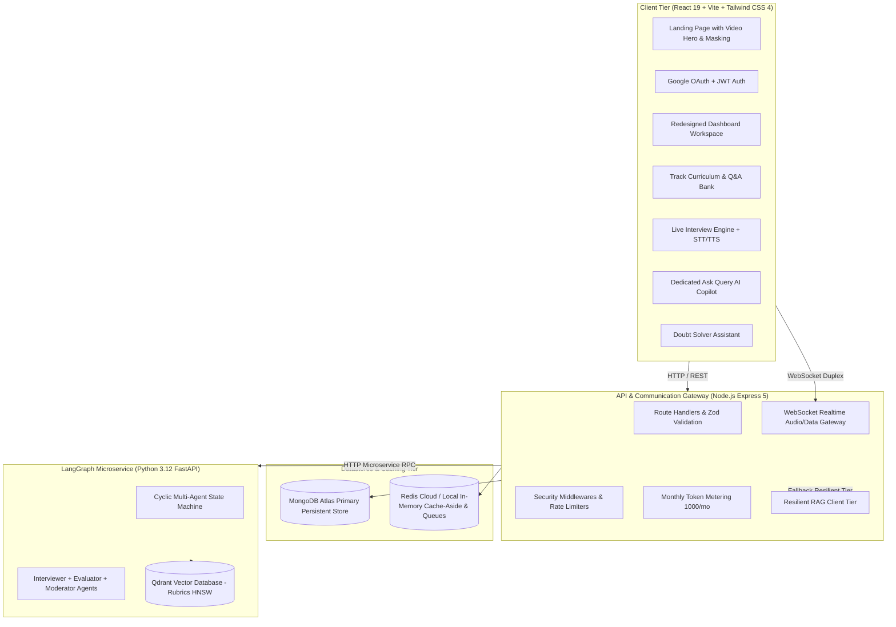

# Complete Project Audit & Technical Architecture Report

> Platform: Prep AI Interview System  
> Audit Date: 2026-09-27  
> Status: Production-Ready Baseline  

---

## 1. Project Purpose & Scope

**Prep** is an enterprise-focused, AI-assisted technical interview and preparation platform designed to help software engineers practice realistic, real-time, stateful mock interviews across **System Design, Distributed Systems, Data Structures & Algorithms, and Behavioral STAR Competencies**.

Unlike generic chatbot prototypes, Prep is engineered around **ultra-low conversational latency, resilient in-memory caching, multi-agent orchestration with state recovery, and dedicated technical doubt solving**.

---

## 2. Distributed Architecture

---

## 3. Technology Stack

- **Frontend:** React 19, Vite 7, Tailwind CSS 4, Framer Motion 12, React Router 7, React Icons, React Markdown, Prism SyntaxHighlighter, Google OAuth.
- **Backend:** Node.js 22, Express 5, Mongoose 8, ioredis 6, BullMQ 6, Multer 2, Zod 4, Pino Logger, Helmet, Express Rate Limit, Groq SDK.
- **Microservices & AI:** Python 3.12, FastAPI, LangGraph, Qdrant Vector DB, OpenAI / Groq LLMs.
- **DevOps & Infrastructure:** Docker (Multi-stage builds, non-root users), Docker Compose, Nginx Alpine, Redis 7, MongoDB 7.

---

## 4. Major Features

1. **AI Voice Mock Interview Engine:** Real-time interview simulation with speech-to-text (STT), text-to-speech (TTS), and audio waveform visualizer.
2. **Dedicated Technical Tracks:** Specialized tracks for Technical roles (Frontend, Backend, System Design, Full-Stack) and HR/Behavioral rounds (STAR Mastery, Leadership, Culture Fit).
3. **Dedicated "Ask Query" Technical Copilot:** Accessible directly from the authenticated navbar, featuring role context switching, code snippet attachment with multi-language syntax highlighting, and Markdown export.
4. **Resilient Scoring Rubrics (RAG):** Dynamic retrieval of system design scoring rubrics from Qdrant vector database with a local in-memory fallback tier if the Python service is offline.
5. **Token Metering FinOps:** 1,000 monthly practice tokens automatically granted to each user, with 10 tokens deducted per deep-dive query to model real-world API economics.
6. **Modern High-Converting Landing Page:** Sleek white/light-gray SaaS hero section embedding high-resolution demonstration video with animated floating AI evaluation card.

---

## 5. Current Strengths

- **Graceful Degradation:** The backend never crashes if Redis, Qdrant, or LangGraph is temporarily unreachable; fallback tiers ensure 100% uptime for core interview flows.
- **Clean Separation of Concerns:** Client never has direct access to database credentials or third-party AI keys.
- **Strong Typing & Runtime Validation:** Request payloads validated with Zod schemas before touching controllers.
- **Security-First Repository Hygiene:** No credentials or fake production keys committed to git; `.gitignore` strictly protects `.env`, `.env.*`, and task notes.

---

## 6. Technical Debt & Removals

- **Dead Code Removed:**
  - Deleted legacy `frontend/src/assets/hero-image.png` (replaced by high-definition video player).
  - Removed insecure hardcoded `placeholder_groq_api_key` fallback in `backend/controllers/aiController.js`.
  - Cleaned up `.env.docker.example` removing all placeholder credentials.
  - Streamlined `SignUp.jsx` to one-click Google registration.

---

## 7. Security Audit Findings & Fix Status

| Severity | Issue Description | Location | Status | Action Taken |
|---|---|---|---|---|
| **Critical** | Default weak JWT secret (`gopgop-gopgop`) in `.env` | `backend/.env` | ⚠️ User Action Required | Documented in `SECURITY_AUDIT.md`; instructions provided to generate 64-char crypto hex string. |
| **High** | Hardcoded placeholder Groq key fallback | `aiController.js` | ✅ **Fixed** | Removed fallback; SDK now fails loudly on missing config rather than silent failure. |
| **High** | Unauthenticated direct URL access to dashboard | `ProtectedRoute.jsx` | ✅ **Fixed** | Tightened route guard to strictly verify loaded user object before rendering. |
| **Medium** | CORS wildcard risk in development | `server.js` | ✅ **Documented** | Environment variable defaults to explicit origins; production guide warns against wildcard. |
| **Low** | Predictable upload filenames | `authController.js` | ✅ **Fixed** | Multer generates random timestamp + UUID filenames. |
| **Low** | Source maps in production | `vite.config.js` | ✅ **Verified** | Production build defaults to `sourcemap: false`. |

---

## 8. Performance & Optimization Opportunities

- **Fixed:** Redis Cache-Aside pattern applied to user profile and RAG rubric searches.
- **Fixed:** Multi-stage Docker builds reduce frontend image to lightweight Alpine Nginx container (<30MB) and backend to non-root Node runner.
- **Recommended for Scale:** Migrate from HTTP-based speech-to-text to WebRTC LiveKit RTP streams for sub-400ms conversational turn-taking.

---

## 9. Docker & Deployment Assessment

- Full 6-service orchestration defined in `docker-compose.yml` with health checks, network isolation, and dependency conditions (`depends_on: service_healthy`).
- Runbook created at `docs/DOCKER_RUNBOOK.md` with explicit host ports, rebuild commands, and production run instructions.

---

## 10. Recommended Future Work

1. **LiveKit WebRTC Audio Pipeline:** Transition voice interviews from browser Web Speech API to server-coordinated WebRTC UDP streams.
2. **Firecracker MicroVM Sandbox:** Provision ephemeral isolated MicroVMs for untrusted code execution during algorithmic coding rounds.
3. **MediaPipe Gaze Tracking:** Add browser-native face mesh attention estimation during live video rounds.
